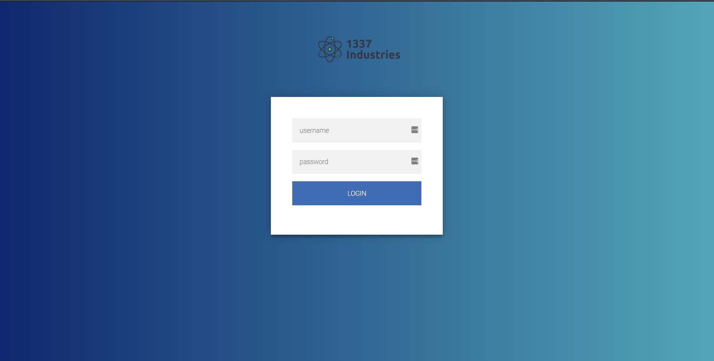

## Investigation

This was the only cryptography problem I could solve before time ended. I've been comfortable figuring out and researching
web-based exploits but cryptography problems are still pretty novel.

The problem described an intern who swore they wrote a perfectly secure login page and dared me to break it.
The page UI itself isn't important but you can see it here for context.



The gave me the code for the website and I've included it in LocalCode. I'll also paste it below because it's just one
file and then I can refer to it directly in this writeup.

Website Code:

```
from flask import Flask, request, render_template
from flask.helpers import make_response
import jwt
from authlib.jose import jwk


app = Flask(__name__)
app.config['JWT_ALGORITHM'] = 'RS256'
app.config['JWT_SECRET_KEY'] = open('id_rsa.pem').read() 
app.config['JWT_PUBLIC_KEY'] = open('id_rsa.pub').read()

def check_if_authenticated(template):
    if 'ACCESS_TOKEN' not in request.cookies:
        resp = make_response(render_template(template))
        resp.set_cookie('ACCESS_TOKEN', generate_token('guest', False), max_age= 60*60*24)
        return resp
    resp = make_response(render_template(template))
    return resp

def generate_token(user, logged_in):
    token = jwt.encode({"user": user, "logged_in" : logged_in}, 
                        app.config['JWT_SECRET_KEY'], 
                        algorithm= app.config['JWT_ALGORITHM'],
                        headers={"public_key": jwk.dumps(app.config['JWT_PUBLIC_KEY'], kty='RSA')}
    )
    return token

@app.route('/', methods=['GET', 'POST'])
def index():
    return check_if_authenticated('login.html')

@app.route('/login', methods=['GET', 'POST'])
def login():
    if request.method == 'POST':
        return render_template('login.html', response = "Login page is under construction.")
    return render_template('login.html')

@app.route('/flag', methods = ['GET'])
def flag():
    try:
        token = jwt.decode(request.cookies['ACCESS_TOKEN'], app.config['JWT_PUBLIC_KEY'], verify=True, algorithms= app.config['JWT_ALGORITHM'])
        if token['logged_in']:
            return render_template('flag.html', response = "--redacted--")
        else:
            return index()
    except:
        return index()
```

You can see above that the flag is just on the /flag endpoint.

In the /login endpoint, you can see that they don't even read the request body so the username and password inputs are totally
irrelevant.

When you go onto the website, they check if you have an 'ACCESS_TOKEN' cookie. If not, then they make one for you.
The 'ACCESS_TOKEN' cookie is a JWT, where they set a user parameter to 'guest' and and logged_in parameter to false. You
can see all this in the check_if_authenticated() function above that's called on the root endpoint.

As you can see in the /flag route, that logged_in parameter needs to be set to true to access the flag.

You can see in the generate_token(user,logged_in) function that they put the public key information in the header of the JWT in
the form of a JWK. I don't have access to the JWT as I'm writing this, but rest assured that you could construct the public key
pretty easily by getting the JWK and using a module called jwk-to-pem (https://www.npmjs.com/package/jwk-to-pem).

At this point, I fell into a lot of rabbit holes. A few of the web exploitation questions concerned JWT's but none of those methods 
were working here. It seemed impossible until I remembered this was a cryptography question, not a web exploitation question.

They were using RS256 to sign the JWT, so I looked up a bunch of RSA exploits and tried them one by one. Soon enough I found
something called Fermat's Factorization theorem.

## Solution

Fermat's factorization is a method used to crack the private key in RSA given a weak public key. If the private key is close
to the public key, then you can use Fermat's factorization to figure it out. The mathematics of it is explained on this website
(https://wiremask.eu/articles/fermats-prime-numbers-factorization/). 

That website also had a python script that takes in the public key spits out the private key. They even mention how useful
it is in CTF competitions. That code is below:

```
#!/usr/bin/env python
import gmpy2

N = 0 #Your public key 

def fermat_factor(n):
    assert n % 2 != 0

    a = gmpy2.isqrt(n)
    b2 = gmpy2.square(a) - n

    while not gmpy2.is_square(b2):
        a += 1
        b2 = gmpy2.square(a) - n

    p = a + gmpy2.isqrt(b2)
    q = a - gmpy2.isqrt(b2)

    return int(p), int(q)

if __name__ == "__main__":
    (p, q) = fermat_factor(N)

    print("p = {}".format(p))
    print("q = {}".format(q))
```

Once you have the private key, it's trivial to encrypt your own JWT with logged_in set to true, and pass that into the website.

This problem was a real eye opener in how much more I have to learn. The time spent on all those failed rabbit holes though
were still valuable and I'll take them with me next time I do a CTF.