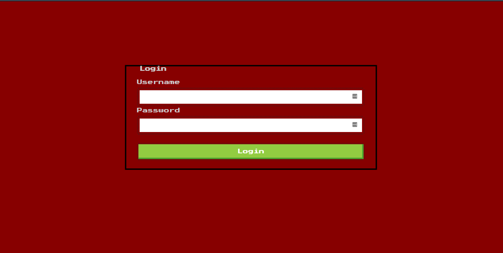

## Investigation

We didn't get any code files for this problem. They only gave us a website with this landing page.



I've done one CTF before (picoCTF2018) and I learned there that SQL injection is a pretty common exploit. It's generally one of
the first things I try before I've formally started investigating. On a whim I tried the first line in the Wikipedia article
for SQL injection. It was only days after I solved it that I realized EsQueElle is a bit of French for SQL.

## Solution

That Wikipedia line used was:

```
' OR '1'='1
```

Putting that into both the Username and Password fields let you login and get the flag.

