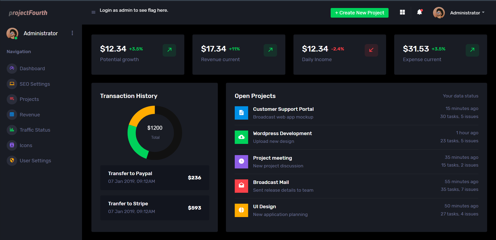
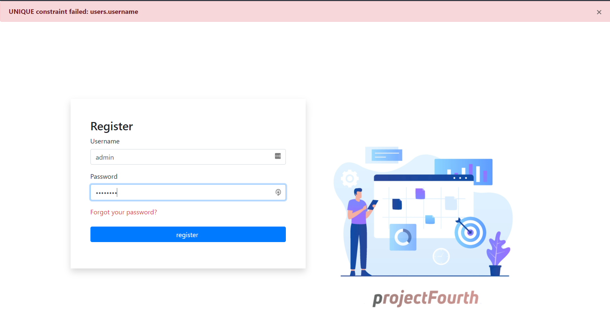

## Investigation

This web exploitation was one of the few that didn't include the code in the problem. That meant a lot more blind testing than usual.

On opening up the webpage you're presented with a standard registration page. After creating a user and logging in with it you're
given this landing page.



The problem is clear now, try and get them to see me as an admin. I tried creating a new user with admin as the username and found
that this failed their unique validation checks.



I didn't expect them to just let me create an admin user, but this isolated the problem into just making them think my username
was admin. I did try some SQL and NoSQL injection with no luck, so I just logged in as a random user and looked into the landing page.

Eventually I found an session token that looked a lot like a JWT. Putting it into jwt.io showed me its contents.


I've used JWT's before and a few of the other problems involved JWT spoofing. The header told us it's using RS256, and usually it 
would then give a public key so we could decrypt the signature and be certain that it was encypted with their private key. But in lieu of that, we were given an endpoint under a jku parameter.

I'd never seen the jku parameter before and exploits based off of it were entirely new to me. The IETF standard defines jku's as:

```
The "jku" (JWK Set URL) Header Parameter is a URI [RFC3986] that
refers to a resource for a set of JSON-encoded public keys, one of
which corresponds to the key used to digitally sign the JWS.  The
keys MUST be encoded as a JWK Set [JWK].  The protocol used to
acquire the resource MUST provide integrity protection; an HTTP GET
request to retrieve the JWK Set MUST use Transport Layer Security
```

Going to that jku endpoint gives you the jwk information needed to construct the public key.


The problem now has been isolated to setting my username to admin while still matching the signature generated from their private key.
Some common exploits like changing the alg to a symmetric encryption algorithm didn't work. Researching more about jku's though
showed that some websites used the jku in the header of the incoming JWT to construct their own public key.

That is, instead of storing the public key on a server, converting it a jwk and putting that on an endpoint for others to verify,
they look at the header of the JWT, go the endpoint specified under the jku, and construct a public key from that endpoint to check
the jwt signature. Because the header is just base64 encoded, I can easily change the jku parameter to my own server and use a public
key from a public-private key pair that I generate.

## Solution

I created a Flask server for the CTF that I could use just in case I needed it. It turned out to be very useful here.

First step was to make the public-private key pair and get their jwk's. To do so I found a great website that lets you put in the key 
use, algorithm, and key id and will generate a random public and private key and their jwk's. 

You can access that site here (https://mkjwk.org/).

![My-JWK] (Images/ProjectFourth-MyJWKs.png)

You can see here though the n and e parameter here are base64 encoded, while the JWK on the site of the problem is in decimal. 
Frankly I'm still not sure why their site uses decimal when the standard is to base64 encode it but regardless I converted it into decimal to match their process.

I put that public key JWK onto my own endpoint and changed the jku to point to my server. This meant that they would use this
key to decrypt the signature. As I generated this pair, I also had the private key which I could use to encrypt it for the signature.

The endpoint I created is below:

```
@app.route('/jwks.json', methods=["GET"])
def getJWK():
    obj = {
    "keys": [
       {
        "kty": "RSA",
        "e": "65537",
        "use": "sig",
        "kid": "80a09454-9019-4677-8c37-41ddf81d6cf3",
        "alg": "RS256",
        "n": "20272948581678369095499996863079702909141724406798875667077276276258496689207957676201581355658733849092547202635126002045548798147496994989972400701419071145061970213349644584147697418711640600760828905022346119512556838513807502402312711757661005051309985059139359286971185177840913892730051594262305627865776995856643106071500870331665767429813777329495801953290056041329167846316485604922851744918813234960313500234684695823583111558336523729442338223268363843428964940770133056441159672958980648234894574227938894900810066165851252785398809094973137216169091136894931817939405167483134937968893494666192974128903"
        }
        ]
        }

    return obj
```

The rest of it was simple. Change the username to admin and sign it using my private key. They would use my public key to decrypt it,
thus passing their signature verification and netting me the flag.

This was a real insight into just how important storing the public key locally is. I'd always focused my efforts on protecting the
private key, but the private key is only as important as the public key. If a bad actor can change the public key you use to verify 
the signature, the private key is meaningless no matter how securely it's stored.