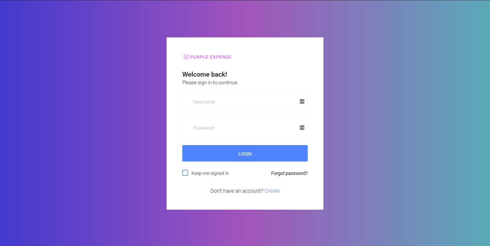
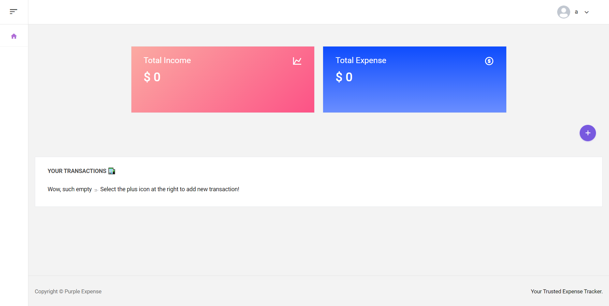
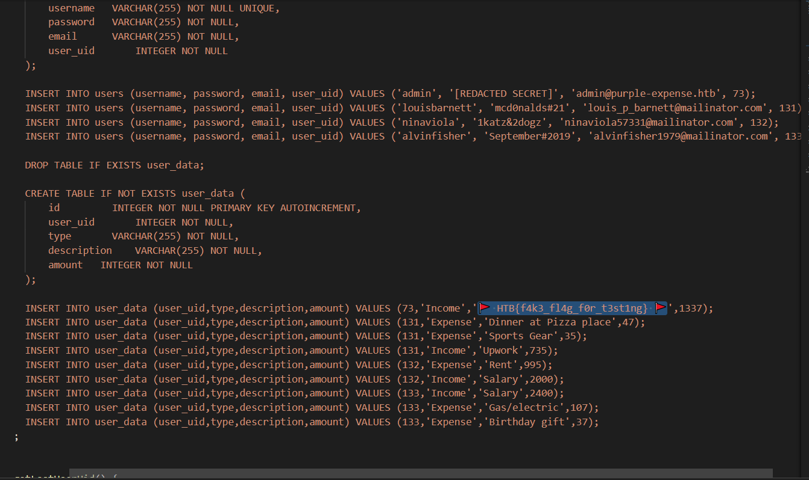
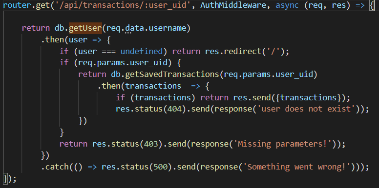
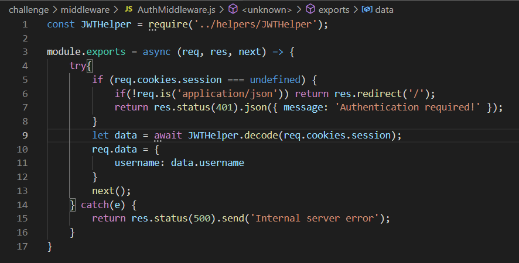
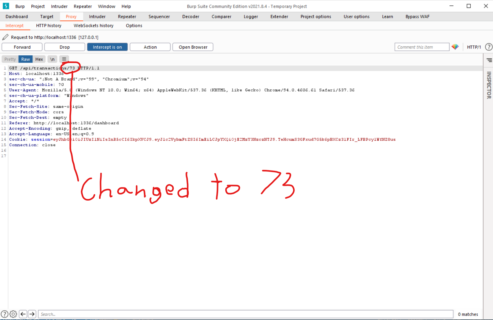
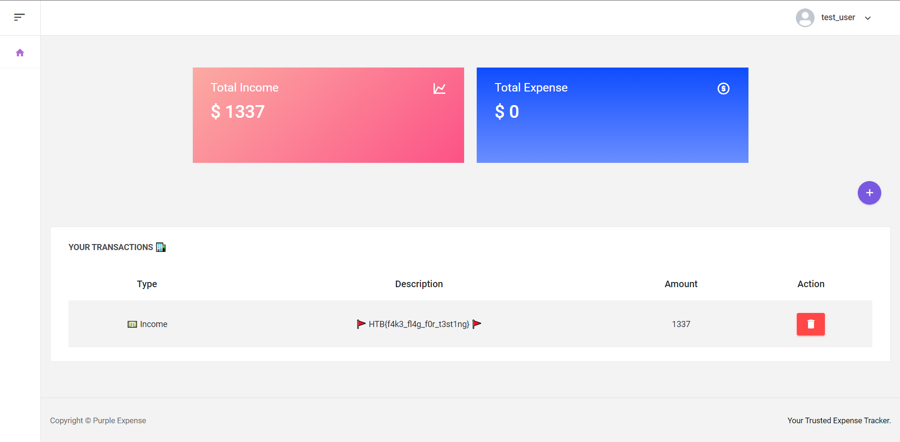

## Investigation

The problem described an expense sheet website that tracked income and expenses. 
They gave us the code for this problem and I've included it here if you wanted to try it yourself. Check it out in Local Code.

On opening up the site you're presented with a standard sign in page.



On creating a user and logging in, you are shown the expense dashboard of the website.



Going through the code, the first thing to do is find the flag. It looked like it was just an expense transaction for the admin user



I mentioned in HealthChecker that the problem there was actually straightforward because there was really only one way to solve it.
This was the opposite.

They let you input new transactions so I thought it might be a SQL injection or a Template injection. They were using sqlite so it's
not inconceivable. Many hours of investigation turned up nothing with that though.

There was also a JWT used as an access token. Many of the problems involved spoofing JWT's and altering their contents but that also
wasn't the case here.

Looking through the code further though you spot an interesting feature of the relational database design they're using. They
have two tables, one to store the user and one to store the user's expense transactions. They are related by a user_uid field:

```
CREATE TABLE IF NOT EXISTS users (
        id         INTEGER NOT NULL PRIMARY KEY AUTOINCREMENT,
        username   VARCHAR(255) NOT NULL UNIQUE,
        password   VARCHAR(255) NOT NULL,
        email      VARCHAR(255) NOT NULL,
        user_uid       INTEGER NOT NULL
    );

CREATE TABLE IF NOT EXISTS user_data (
        id         INTEGER NOT NULL PRIMARY KEY AUTOINCREMENT,
        user_uid       INTEGER NOT NULL,
        type       VARCHAR(255) NOT NULL,
        description    VARCHAR(255) NOT NULL,
        amount   INTEGER NOT NULL
    );
```

As you can see in the above image of the flag in the code, the admin has a user_uid=73.

Now looking for how the website gets the users expense transactions, you find an API endpoint that passes the user_uid as a
query parameter in a GET call.



Taking a look at the AuthMiddleWare, you'll see that it's just used to parse the username from the JWT.



That's a really interesting way to introduce a vulnerability. They check the username and, as far as I can tell, they correctly
verify that the user exists and was encrypted with their private key, but they don't do any checking to make sure that user_uid
corresponds to that user.

## Solution

At some point they call that API endpoint with the user_uid of the user you log in with. If you intercept that call and change it to
the user_uid of the admin (73), it will return the admins expense transactions and therefore return the flag.

I used Burp Suite to intercept the call and just changed the id when they made the GET call. This gets you the flag.





Note from the username in the top right that I never actually logged in as the admin user. I didn't have to do any JWT spoofing.
I just made a slight change when intercepting a GET call.

Despite this problem requiring only a small change to solve, I found it really instructive in protecting my own projects. Checking
the username securely with industry standards like JWT can fool you into a false sense of security. It's the kind of really slight
error that I can see a well intentioned developer making.

Keeping on top of your security is paramount and requires constant vigilance. Thankfully there's often well tested industry protocols
that devs can follow, but when straying from that path you must think like the attacker, not like the developer.