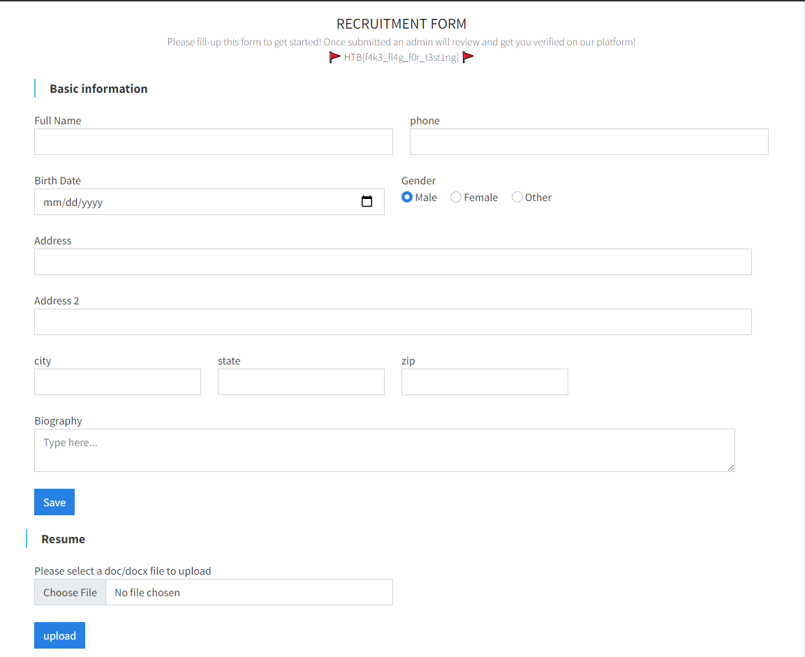

## Investigation

This was a really bizarre problem. To give some context, the questions theoretically increase in difficulty and this problem was 
supposed to be the most difficult of the web exploitation problems.

It turned out to be really simple and much easier than really all but the first web exploitation problem (EsQueQuelle).

The problem described a recruiting website where you put in your details and resume. You see this landing page when you open up the
site. They gave us the code for this problem and I've included it here if you wanted to try it yourself. Check it out in Local Code.

Creating a user and logging in shows that you just need to make yourself look like admin.

I found a session token that was a JWT and put it into jwt.io to see its contents.

They used RS256 so I would need both a public and private key. Going through the code though, I found that they stored the public
and private key locally. This isn't necessarily a big break in the case. If they used a different public-private key pair than the
one they gave me for local testing, then I wouldn't have been able to do much with them.

On a whim though I decided to see if I could use these keys on their website.

## Solution

They bizarrely used the same keys that they gave me for local testing. Seriously you can access those keys yourself by going into
Local\ Code/web_recruit_plus/private.

I just copy pasted those keys into jwt.io and changed the username to admin.

Copy pasting that JWT into the session cookie gave the flag.

The fact that they let you upload a resume makes me think this was orignally an XXE exploit (XML External Entity) and someone
messed up using the same keys they gave to the contestants.