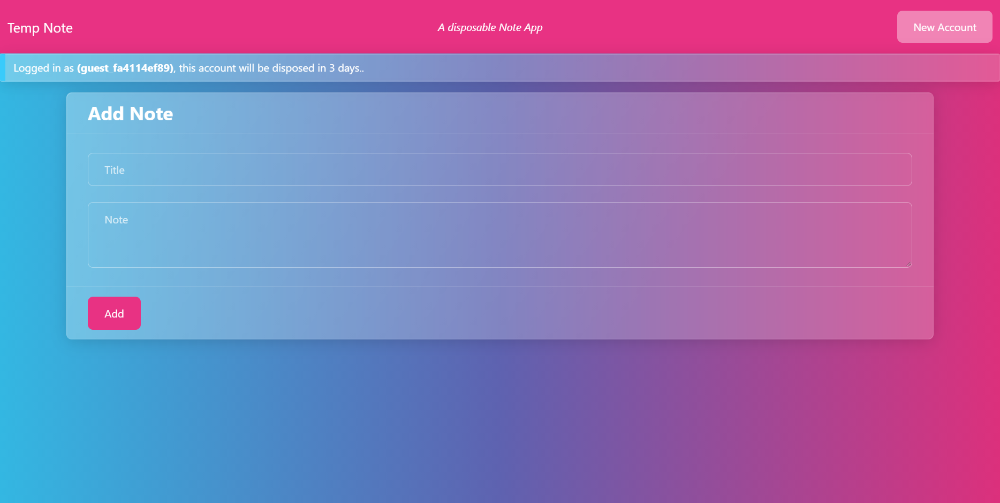
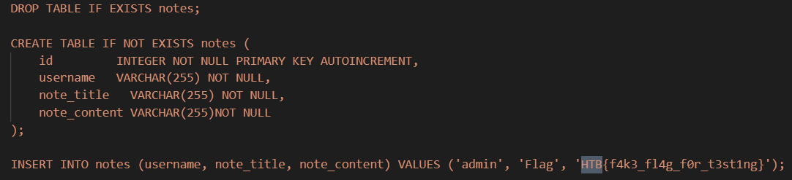
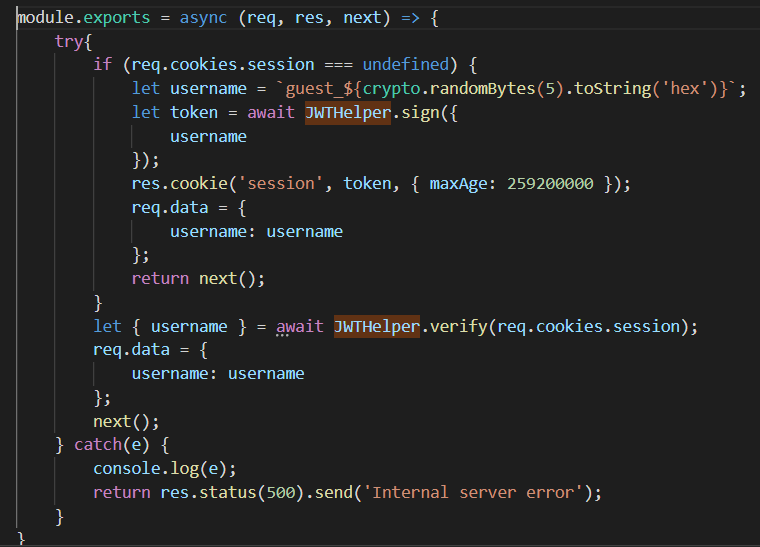
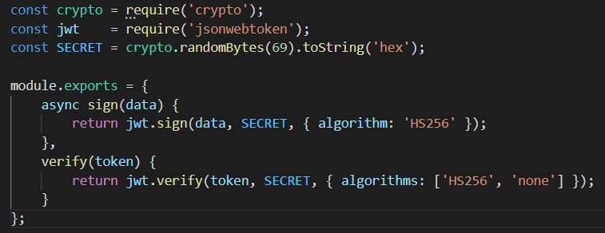
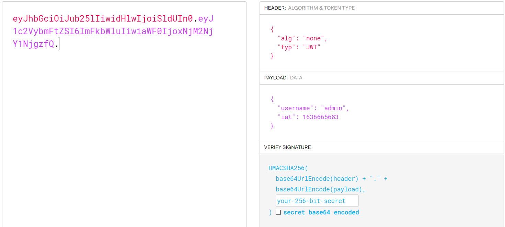
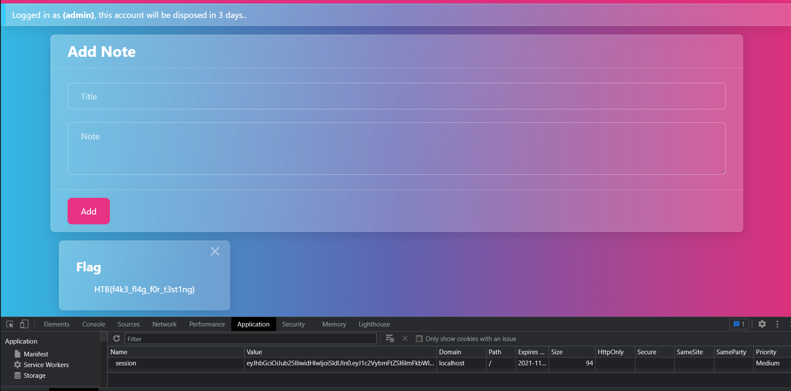

## Investigation

The problem described a disposable notes app that deleted any notes in 3 days. They gave us the code for this problem and I've 
included it here if you wanted to try it yourself. Check it out in Local Code.

Opening up the webpage presented this garish UI that told me I was on a disposable guest account.



Hitting the new account button just creates a new random guest account.

First thing to do is look for the flag in the code. Searching for that showed that the flag was just a note that showed up for the 
admin user.



All I need to do then is set my username to admin.

Going through the code further, I found some authentication middleware that checked the username of the user. You can see here that
it looks for a session cookie and, if it doesn't exist, it'll generate a guest one. 



They're clearly using a JWT for the session cookie. They appear to be calling a verify function to get the username. Going into the
signing and verification functions though revealed something interesting.



They're signing the cookie with HS256, but they're verifying it with either HS256 or none. I have no way of figuring out the secret
used, but I don't actually need to. I can just set the alg to none in the JWT header and the signature becomes irrelevant.

## Solution

Grabbing the session token and putting it into jwt.io, I can see that the alg is set to HS256. jwt.io doesn't actually let me set
the algorithm to none. I used crypto-js(https://www.npmjs.com/package/crypto-js) to create my own JWT.

The code to generate the JWT is:

```
import CryptoJS from "crypto-js";

const encodeJWT = () => {
    var header = {
        "alg": "none",
        "typ": "JWT"
      };
      
      var stringifiedHeader = CryptoJS.enc.Utf8.parse(JSON.stringify(header));
      var encodedHeader = base64url(stringifiedHeader);
      
      var data = {
        "username": "admin",
        "iat": 1636665683
      };
      
      var stringifiedData = CryptoJS.enc.Utf8.parse(JSON.stringify(data));
      var encodedData = base64url(stringifiedData);
      
      var token = encodedHeader + "." + encodedData + ".";

      return token
}
```

You can see in jwt.io that the new token has the alg set to none and there is no signature.



Setting that as my session token and reloading the page nets the flag.



Something I've been learning from CTF's is how tiny mistakes can often be devastating. Making sure you use the same algorithm to
both encrypt and decrypt is just one small step to a secure site, but it's just as vital as any other step. Simplifying all of that 
is why services like Auth0 exists in the first place.